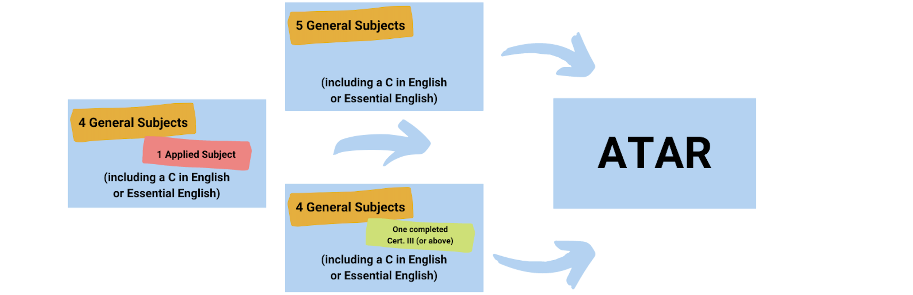
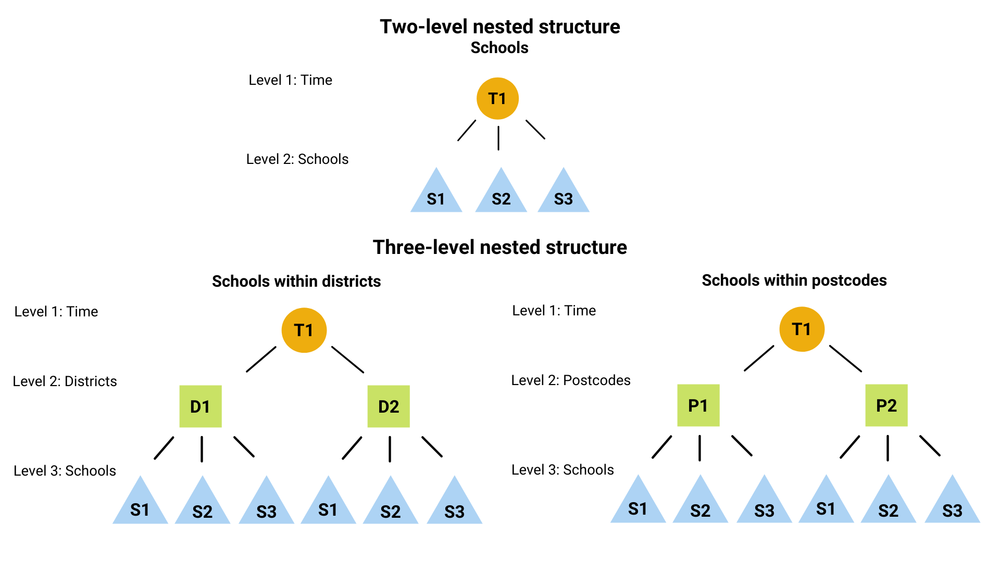

class: title-slide
background-image: url(images/monash-logo.jpeg), url(images/building.jpeg)
background-position: 90% 90%, 100% 0%
background-size: 100px, 100% 80%
background-color: #FFFFFF

```{r setup, echo=FALSE}
options(htmltools.dir.version = FALSE,
        scipen = 999)

knitr::opts_chunk$set(fig.retina = 3, echo = FALSE, warning = FALSE, message = FALSE)
```

```{r themeset, echo=FALSE}
library(tidyverse)
library(dplyr)
library(kableExtra)
library(knitr)
library(lme4)
library(colorspace)
library(patchwork)
library(xaringanthemer)

# Set global theme
ggplot2::theme_set(theme_bw())
```

```{r xaringan-themer, include=FALSE, warning=FALSE}
# Add primary & secondary theme colour
style_duo_accent(
  primary_color = "#000000",
  secondary_color = "#8ee5ee"
)

xaringanExtra::use_panelset()
```

<br>
<br>
<br>
<br>
<br>
<br>
<br>

## `r rmarkdown::metadata$title`

### `r rmarkdown::metadata$subtitle`

<br>
<br>
<br>
<br>
<br>
<br>
<br>

#### .left[By: 🕵🏻 `r rmarkdown::metadata$author`]

#### .left[`r icons::fontawesome$brands$github` <a href="https://github.com/BrendiA"> @BrendiA</a>]

---

name: content-page
class: header_background
#.left[Outline]

<br> 
<br> 
<br> 
<br>
<br> 
<br> 

.large[1️⃣ [Background](#content-page-1)]

.large[2️⃣ [The Dataset](#content-page-2)]

.large[3️⃣ [Data Cleaning](#content-page-3)]

.large[4️⃣ [Exploratory Data Analysis](#content-page-4)]

.large[5️⃣ [Predicting Enrolments](#content-page-5)]

---

## Background

- All Australian states & territories uses a common measure .bold[.fontinverse[(ATAR)]] to rank Year 12 students.
- In 2020, **Queensland** decided to adopt ATAR.
- Up till 2019, Queensland ranked Year 12 students using Overall Position (OP).

???

**Background**
- In most parts of Australia, ATAR is used to assists universities in selecting applicants.

**Queensland**
- Queensland was the latest state to transition into ATAR system, in 2020

--

### Implications

- .bold[OP's] State-wide test (QCS test) for Year 12 students abolished.
- .bold[ATAR] assessments consists of:
  - .fontinverse[.bold[Year 11 syllabus]] (Units 1 & 2): consists of formative assessments to prepare for units 3 & 4 (**do not impact ATAR**).
  - .fontinverse[.bold[Year 12 syllabus]] (Units 3 & 4): consists of four core assessments.
      - Three internal assessments
      - One external assessment assessed by QCAA (Queensland Curriculum and Assessment Authority).
      
???

**Implications**
- This means that the old state-wide exams are replaced with ATAR assessments

- Year 11 syllabus consists of assessments to prepare students for Year 12, these units do not count towards ATAR 

- Year 12 syllabus 
  - consists of 3 internal assessments, which are evaluated by the individual schools
  - and 1 external assessment evaluated by the Queensland government

---

## ATAR Score
`r icons::fontawesome("hand-point-right")` Inter subject percentile-rank where students are ranked relative to their age group.

--

```{r, echo=FALSE, fig.align='center', out.height = "300%"}

```

--

- ATAR is expressed on a .bold[.fontinverse[2,000 point scale]] from 99.95 down to 0.00 in steps of 0.05.

- Typically used to .bold[.fontinverse[assist universities]] in selecting applicants for their courses 🤓.

???

- In general, 5 best subjects are counted to your ATAR
  - Five general subjects **or**
  - 4 General subjects & 1 applied subject
  
- 2,000 point scale, going from 99.95 to 0 in steps of 0.05.
  - This means that if a student have an ATAR score of 80%, the student is placed in the top 20% of students in Queensland.

---

class: center, middle, inverse
.megabold[⛰ Objective 🌋]

--

`r icons::fontawesome("caret-right")` Predict Year 11 and Year 12 enrolments in .bold[Mathematics] and .bold[Science] subjects.

???

The main purpose of my job was to predict the enrolments for the different schools in Queensland

---

class: middle

### 📝 The following research questions guided the analysis:

--

(1) What are the underlying trends in enrolments for senior secondary mathematics and science subjects?

--

(2) Are there differences in enrolments in the new QCE system (after 2020) as compared to the old QCE system (before 2020)?

???

- New system uses ATAR
- old system uses Overall position
---

class: center, middle, inverse
.megabold[The dataset]

???
- Moving on to the dataset

---

class: center

#.fontinverse[🔩 Data Extraction 🔨]

`r icons::fontawesome("download")` Enrolment data can be found in <a href="https://www.qcaa.qld.edu.au/news-data/statistics"> .link-red[QCAA's Website] </a>

```{r, echo=FALSE, out.width="200%", out.height="300%", fig.align='center'}

```

???

- The dataset can be extracted directly from the QCAA website 

---

## Data Description 📝

```{r message=FALSE, echo=FALSE}
library(tidyverse)

# Read-in data
mathsci_all <- read_csv(here::here("data/mathsci_all.csv"),
                        # Changing variable type avoids errors
                        col_types = cols(doe_centre_code = col_factor()))

# Convert data types
mathsci_all <- mathsci_all %>% 
  mutate(across(.cols = c(qcaa_subject_id, 
                          subject_type,
                          qcaa_school_id,
                          sector,
                          school_postcode
                          ),
                ~ as.factor(.x)))

library(kableExtra)

# Extract school 389 from Specialist Mathematics
school17 <- mathsci_all %>% 
  filter(subject_name == "Specialist Mathematics") %>% 
  filter(qcaa_school_id == "17") %>% 
  arrange(completion_year) %>% 
  head(10)

school17 %>% 
  kable(format = "html",
        booktabs = TRUE,
        align = "c") %>% 
  kable_styling(full_width = FALSE,
                bootstrap_options = c("hovered", "striped"),
                font_size = 15) %>% 
  scroll_box(width = "750px", height = "500px")
```

- Each row (observation) corresponds to a school's enrolment information for a subject in a given cohort.

???

- For example, the table shows the enrolment for Specialist Mathematics subject in John Paul College
  - Subject introduced in 1995
  - **School specific variables**: school postcode and district, which sector it belongs to

---

## Data Description
`r icons::fontawesome("project-diagram")` Variables can be broken down into .bold[three components].

```{r echo=FALSE}
tibble(
  Variable =
    c(
      # Enrolment details
      "completion_year",
      "year_11_enrolments",
      "year_12_enrolments",
      # Subject details
      "qcaa_subject_id",
      "subject_name",
      "subject",
      "subject_type",
      # School details
      "qcaa_school_id",
      "school_name",
      "doe_centre_code",
      "qcaa_district",
      "school_postcode",
      "sector"
    ),
  Description =
    c(
      # Enrolment details
      "Graduation cohort's year of completion",
      "Number of Year 11 students enrolled in the subject",
      "Number of Year 12 students enrolled in the subject",
      # Subject details
      "QCAA subject ID",
      "Subject name",
      "Mathematics or Science subject",
      "Type of subject (General, applied or short courses)",
      # School detail
      "QCAA school ID",
      "School Name",
      "Department of Education Centre Code",
      "School district",
      "School postcode",
      "School sector (Government, Independent, Catholic)"
    )) %>% 
  kable(caption = "Description of the dataset used for the analysis",
        font_size = 15) %>% 
  kable_styling(full_width = FALSE,
                bootstrap_options = c("hovered", "striped")) %>% 
  pack_rows(index = c("Enrolment information" = 3,
                    "Subject information" = 4,
                    "School information" = 6)) %>% 
  scroll_box(width = "750px", height = "450px")
```

???

Dataset can be broken down in 3 components:  

(1) Enrolments info  

(2) Subject info  

(3) School info


---

## Mathematics and Science  Subjects

.panelset[
.panel[.panel-name[Math]

.center[

####`r emo::ji("math")` Mathematics `r emo::ji("math")`
```{r}
# --- Mathematics
mathsci_all %>% 
  filter(subject == "Mathematics") %>% 
  # All unique mathematics subjects
  distinct(subject_name, subject_type) %>% 
  # Include Mathematics for old QCE system
  mutate(
    old_subject_name = case_when(
      subject_name == "General Mathematics" ~ "Mathematics A",
      subject_name == "Mathematical Methods" ~ "Mathematics B",
      subject_name == "Specialist Mathematics" ~ "Mathematics C",
      TRUE ~ paste0("---")
    ),
    .before = subject_name
  ) %>% 
  group_by(subject_type) %>% 
  # Arrange subject names in alphabetical order
  arrange(subject_name) %>% 
  ungroup() %>% 
  select(-subject_type) %>% 
  # Produce HTML table
  kable(caption = "Senior Mathematics subjects in the new QCE system",
        col.names = c("Old subject name","New subject name"),
        booktabs = TRUE,
        align = "c") %>% 
  kable_styling(full_width = FALSE,
                font_size = 15,
                position = "center") %>% 
  # Partition subject type
  pack_rows(index = c("Applied Mathematics" = 1,
                      "General Mathematics" = 3),
            italic = T)
```
]
]

.panel[.panel-name[Science]
.center[
#### `r emo::ji("science")`Science `r emo::ji("science")`
```{r science, echo=FALSE}
# --- Sciences
mathsci_all %>% 
  filter(subject == "Sciences") %>% 
  # All unique Science subjects
  distinct(subject_name, subject_type) %>% 
  # Include Sciences for old QCE system
  mutate(
    old_subject_name = case_when(
      subject_name == "Psychology" ~ "---",
      subject_name == "Earth & Environmental Science" ~ "Earth Science",
      TRUE ~ subject_name
    ),
    .before = subject_name
  ) %>% 
  group_by(subject_type) %>%
  # Arrange subject names in alphabetical order
  arrange(subject_name, .by_group = TRUE) %>% 
  ungroup() %>% 
  select(-subject_type) %>% 
  # Produce HTML table
  kable(caption = "Senior Science subjects in the new QCE system",
        col.names = c("Old subject name","New subject name"),
        booktabs = TRUE,
        align = "c") %>% 
  kable_styling(full_width = FALSE,
                font_size = 15) %>%
  # Partition subject type
  pack_rows(index = c("Applied Sciences" = 3,
                      "General Sciences" = 7),
            italic = T)
```
]
]
]

???

Some new subjects were introduced in the new system

**For maths**
- Essential mathematics is introduced

**For science**
- new subject: Psychology
- Change subject name: Earth & Environmental science


---

class: center, middle, inverse
.megabold[🧹 Data Cleaning 🧽 ]

---

class: middle

## The Main Steps

- Examining observations with .fontinverse[.bold[missing values in enrolments]] and imputing missing values with zero.

--

- .fontinverse[.bold[Revise school postcodes]] that were reassigned overtime _(or due to typographical errors)_.

--

- Using regular expressions to .fontinverse[.bold[match school names]] that did not match. 
  - _e.g._ Schools changed their names over time.

--

- .fontinverse[.bold[Matching subject names]] from the old system and the new system.

???


- Most of the data cleaning involves matching names
  - Some schools may change their postcodes or names overtime

---

## Missing Values

.panelset[
.panel[.panel-name[Plot]
```{r message=FALSE, echo=FALSE, fig.width=12}
library(naniar)

mathsci_all %>% 
  # Convert zeroes back to NA (replicate the raw data)
  mutate(year_11_enrolments = na_if(year_11_enrolments, 0), 
         year_12_enrolments = na_if(year_12_enrolments, 0)) %>% 
  # Display missing values
  naniar::vis_miss(warn_large_data = FALSE,
                   sort_miss = TRUE
                   ) +
  scale_fill_manual(labels = c("Present (99.2%)", "Missing (0.8%)"),
                    values = c("grey80", "black")) +
  theme(panel.grid = element_blank())
```
]
.panel[.panel-name[Findings]
.pull-left[

**Zero enrolments in Year 11 units**

- 67% of missing values due to 2019 graduating cohort that were part of the Queensland .fontinverse[.bold[first Prep year cohort.]]

**Zero enrolments in Year 12 units**
- 71% of zero enrolments in year 12 due to the first year in which a school .fontinverse[.bold[introduces a subject.]]
]
.pull-right[

**No Department of Education Centre Code (DOE)**
- Refers to schools that .fontinverse[.bold[existed before 2002]] and not assigned any DOE code.
]
]
]

???

**Zero enrolments in year 11**
- First prep year cohort

**Zero enrolments in year 12**
- Year 12 units requires completion of year 11 syllabus, making most students illegible for year 12 units.

---

class: center, middle, inverse
.megabold[🔦Exploratory Data Analysis🔎]

---

#### A surge in enrolments in the new .link-red[QCE] system `r icons::fontawesome("chart-line")`

--

.panelset[
.panel[.panel-name[Plot]

```{r totalenrol, message=FALSE, echo=FALSE, fig.width=12}
# Compute total Year 12 enrolments for each year, by subject
total_enrolments <- mathsci_all %>% 
  group_by(completion_year, subject_name, subject) %>% 
  summarise(total_year12_enrolments = sum(year_12_enrolments),
            .groups = "drop") 

total_enrolments %>% 
  ggplot() +
  # Enrolments for all years (old & new system)
  geom_col(aes(x = completion_year,
               y = total_year12_enrolments),
           fill = "grey80") +
  # Enrolments for from 2019 (new system)
  geom_col(aes(x = completion_year,
               y = total_year12_enrolments),
           fill = "grey30",
           data = filter(total_enrolments, completion_year > 2019)) + 
  facet_wrap(~ subject_name,
             scales = "free_y") +
  scale_x_continuous(breaks = seq(1992, 2022, by = 2),
                     labels = seq(1992, 2022, by = 2)) +
  theme(panel.grid.minor = element_blank(),
        axis.text.x = element_text(angle = 90)) +
  labs(title = "Total Enrolments for each subject",
       x = "Completion Year",
       y = "Year 12 Enrolments")
```

]
.panel[.panel-name[Findings]

**Full cohort from 2020 🎓**
- The significant increase in enrolments from 2020 onwards was due to the .bold[2007 prep year cohort] the left the schooling system at the end of 2019.
  - From 2020, every year will be a full cohort, implying an additional group of students and higher expected enrolments in the new system.
  
**Subjects were introduced at different time frames**
- Marine science and Aquatic practices introduced in 2014 and 2015 respectively.
- Halt in Agricultural Science from 2000, before re-introduced again in 2015 👨🏻‍🌾.
]
]

???

**Plot description**
- This plot shows the total enrolments across the years
- The **black bars** are the enrolment numbers for the new system

**Full cohort in 2020**
- Huge increase in enrolments from 2020 was due to the .bold[2007 prep year cohort] that left the schooling system at the end of 2019
  - This means that from 2020, every year will be a full cohort

**Subjects were introduced at different time frames**
- Halt in Agricultural science in 2000, before being re-introduced again in 2015
- Some subjects were only introduced in the later years


---

#### Enrolments for each school with an overall fit using the mean enrolments `r icons::fontawesome("ruler-combined")`
--

.panelset[
.panel[.panel-name[Plot]

```{r pivotlonger, message=FALSE, echo=FALSE}
# Convert to long format for plotting
mathsci_all_long <- mathsci_all %>% 
  pivot_longer(cols = c(year_11_enrolments, year_12_enrolments),
               names_to = "unit",
               values_to = "enrolments")
```

```{r timeplotenrolments, message=FALSE, echo=FALSE, fig.width=12}
mathsci_all_long %>% 
  # filter(subject_name == "Earth & Environmental Science") %>% 
  group_by(qcaa_school_id, subject_name, unit) %>%
  # Fill missing years with NA to skip when plotting line plot
  tidyr::complete(completion_year = min(completion_year):max(completion_year),
           fill = list(value = NA)) %>% 
  filter(unit == "year_12_enrolments") %>% 
  ggplot() +
  geom_line(aes(x = completion_year,
                y = enrolments,
                group = qcaa_school_id),
            colour = "grey40",
            alpha = 0.4) +
  stat_summary(aes(x = completion_year,
                   y = enrolments,
                   group = 1),
               fun.y = mean,
               colour = "orange",
               geom = "line",
               size = 1.5) +
  scale_x_continuous(breaks = seq(1992, 2022, by = 2),
                     labels = seq(1992, 2022, by = 2)) +
  facet_wrap(~ subject_name,
             scales = "free_y") +
  theme(axis.text.x = element_text(angle = 90)) +
  labs(x = "Completion Year",
       y = "Year 12 Enrolments")
```

]
.panel[.panel-name[Findings]

**Some subjects showed stable enrolment numbers 📊**
- *e.g.* Biology, Chemistry, Physics, General Mathematics and Mathematical Methods.

**Enrolment patterns across school appears to be proportional to one another**
- When there is a general increase (decrease) in enrolments, most schools will show an increase (decrease) in enrolments.
  - Most of the variations are due to the different school sizes.
  
**Some schools showed erratic enrolment patterns**
- The erratic patterns are usually associated with subjects with generally small enrolment numbers.
  - *e.g.* Agricultural Science and Earth and Environmental science `r emo::ji("globe")`.

]
]

???

- The plot shows the trend in enrolments across all schools, with the yellow line being the average 

- Stable enrolment in Biology, Chemistry, irregular patterns in Earth and environmental science


- On overall, school enrolments appears to be proportional to one another; Meaning that when there is an increase in enrolments in one school, most schools will also show an increase in enrolments

- This implies that the variation in enrolments can be explained by the difference in school sizes


---

#### It is common for Year 11 students to continue pursuing Year 12 units `r icons::fontawesome("chalkboard-teacher")`

--

.panelset[
.panel[.panel-name[Plot]

```{r pursueyear12, echo=FALSE, fig.width=12}
mathsci_all %>%
  ggplot() + 
  # Scatter plot
  geom_point(aes(x = year_11_enrolments,
                 y = year_12_enrolments),
             alpha = 0.3,
             colour = "grey30") +
  # Plot 45° line 
  geom_abline(slope = 1,
              intercept = 0,
              size = 1.5,
              colour = "red",
              alpha = 0.5) +
  facet_wrap(subject_name ~ subject,
             scales = "free") +
  labs(title = "Year 12 enrolments against year 11 enrolments,",
       x = "Year 11 enrolments",
       y = "Year 12 enrolments")
```

]
.panel[.panel-name[Findings]

**Red line represents a perfect linear relationship 📈**
- *i.e.* a one unit increase in Year 11 with a one-unit increase in Year 12 enrolments. 
- Most subjects lie within this red line, suggesting a strong linear relationship.
  - Intuitively, this is reasonable as a student is likely to complete Year 12 syllabus after completing Year 11.

**Observations lying below the red line**
- Generally represents student who dropped the subject or have taken a gap year.
- Students are generally recommended to enrol in 6 subjects for senior school.
  - Acts as a .bold[.fontinverse[safety net]] in the instance where students did not perform well (ATAR counts best of 5 subjects).
  - However, a student drops down to 5 subjects in year 12 so they can focus on lesser subjects.

**Observations lying above the red line**
- Generally represents students who completed a year 11 subject in year 10 and re-enrolled in year 12.
  - Making a given cohort in year 12 relatively larger than that of the year 11 cohort.
]
]


???

- The plot shows a scatter plot of year 12 enrolments against year 11 enrolments


**Red line**
- The 45° red line, suggests that a student continued the subject into year 12 after completing year 11
  - Most schools follow it
  
**Observations lying below the red line** (switch to findings)
- Student dropped the subject or took a gap year
  - In general, it is advised for students to enrol in 6 subjects as it acts as a safety net in the instance where the student don't perform well in a subject (ATAR counts best of 5 subjects)
  - However, students may drop down to 5 subjects in year 12 so they can focus on lesser subjects 

**Observations lying above the red line**
- Students who completed year 11 subject in year 10 and re-enrolled in year 12


---

class: center, middle, inverse

.megabold[👨🏻‍🏫Predicting Enrolments🪄]

---

### The Multilevel Model

```{r, echo=FALSE, fig.width=8, fig.height=6, fig.align='center'}

```

???

- I have chosen the multilevel model because of the nested structure of the dataset

**These are the 3 possible models**
- Two level nested structure: Schools with a time structure that is correlated to one another

- Three level nested structure
  - Schools nested within postcodes
  - Schools nested within districts

---

.center[## Building the Multilevel Model 👷🏻‍]

1. Exploring the data with basic linear models within schools

2. Getting the dataset ready for modelling

3. Unconditional means (null) model

4. Unconditional growth model

5. Text fixed effects using AIC

6. Test random effects using parametric bootstrap

7. Interpret model

---

class: center, middle, inverse

.megabold[👨🏼‍🔬 Predicting Enrolments for Physics 🛩]

---

### Physics

1.🔍 Exploring the data with basic linear model within schools.

--

.panelset[
.panel[.panel-name[Plot]

```{r message=FALSE, echo=FALSE}
# Enrolments for Physics 
phys <- mathsci_all %>% 
  filter(subject_name == "Physics")

# Convert to long format for modelling & plotting purposes
phys_long <- phys %>% 
  pivot_longer(cols = year_11_enrolments:year_12_enrolments,
               names_to = "unit",
               values_to = "enrolments") 
```

```{r linearmodel, message=FALSE, echo=FALSE, fig.width = 10, fig.height = 6}
# Fit a linear model for 20 random sampled schools
set.seed(999)
phys_long %>% 
  filter(qcaa_school_id %in% sample(qcaa_school_id, size = 16),
         enrolments > 0) %>% 
  ggplot(aes(x = completion_year,
             y = enrolments)) +
  geom_point() +
  stat_smooth(method = "lm",
              colour = "orange") +
  facet_wrap(~ qcaa_school_id) +
  scale_x_continuous(breaks = seq(1992, 2022, by = 2),
                     labels = seq(1992, 2022, by = 2)) +
  theme(axis.text.x = element_text(angle = 90)) +
  labs(x = "Completion year",
       y = "Enrolments") 
```
]
.panel[.panel-name[Findings]

**🔎Convenient at-a-glance visualisation🔍**
- Summarises enrolment patterns with only two summary statistics - intercept and slope.
  - Intercept represents enrolments when subject was first introduced.
  - Slope convey's a school's average yearly increase in enrolment over the period.
- Some schools (school 11 & 358) appears to have larger increase in enrolments as compared to other schools.
- Some enrolment stayed relatively constant (school 467 & 614)

**Findings**
- School 358 have a relatively larger increase in enrolments over the years, as compared to the other schools.
- School 1 introduced the subject in 1992 & ceased the subject in 1997.
- Schools 355 and 358 only introduced the subject in the later years.

]
]

???

Plot shows a basic linear model for each school to look at the general patterns in enrolments

**Schools not offering the subject today**: School 1 (top-left) & school 633 (bottom-right)

Top-left: School 11 are one of the **larger schools** as compared to the other schools, which **larger increase in enrolments** over the years as compared to other schools

---

### Physics

2.📠Getting the dataset ready for modelling.

.panelset[

.panel[.panel-name[Removing Data]

.bold[.fontinverse[Removing zero enrolments in the data]]

```{r removezero, message=FALSE, echo=FALSE, fig.align='center', fig.width=8, fig.height=5}
p1 <- phys %>% 
  ggplot(aes(x = year_11_enrolments,
                 y = year_12_enrolments)) +
  geom_point(alpha = 0.3) +
  geom_point(data = filter(phys, year_11_enrolments == 0 | year_12_enrolments == 0),
             colour = "#f08080",
             alpha = 0.2) +
  labs(title = "All observations") +
  theme(title = element_text(size = 8))

p2 <- phys %>% 
  filter(year_12_enrolments != 0,
         year_11_enrolments != 0) %>% 
  ggplot() +
  geom_point(aes(x = year_11_enrolments,
                 y = year_12_enrolments),
             alpha = 0.3) +
  labs(title = "Removed observations with 0 enrolments") +
  theme(title = element_text(size = 8))

p1 / p2
```
]

.panel[.panel-name[Linearise]

.bold[.fontinverse[Linearise response variable using log transformation]]

```{r linearlog, message=FALSE, echo=FALSE, fig.align="center", fig.width=10, fig.height=5}
p1 <- phys_long %>%
  ggplot(aes(enrolments)) +
  geom_histogram(binwidth = 15,
                 fill = "white",
                 colour = "black") +
  geom_density(aes(y = 15 * ..count..),
               fill = "steelblue",
               alpha = 0.4) +
  labs(title = "Before log transformation",
       x = "Enrolments",
       y = "Density")

p2 <- phys_long %>%
  ggplot(aes(log(enrolments))) +
  geom_histogram(binwidth = 0.3,
                 fill = "white",
                 colour = "black") +
  geom_density(aes(y = 0.3 * ..count..),
               fill = "steelblue",
               alpha = 0.4) +
  labs(titile = "After log transformation",
       x = "Log Enrolments",
       y = "Density")

p1 / p2
```
]
]

---

### Physics

3.🙈Unconditional means (null) model

```{r, echo=FALSE}
# ----- Cleaning script

phys <- phys %>% 
  # Remove graduating cohort 2019 
  filter(completion_year != 2019) %>% 
  # Remove schools that offer subject in one of Year 11 or Year 12 only
  filter(year_12_enrolments != 0,
         year_11_enrolments != 0)

phys_long <- phys_long %>% 
  # Remove graduating cohort 2019 
  filter(completion_year != 2019) %>% 
  # Remove schools that offer subject in one of Year 11 or Year 12 only
  filter(enrolments != 0)

# Rescale `completion_year` variable
phys_long <- phys_long %>%
  # Recentre year
  mutate(year92 = completion_year - min(completion_year),
         .before = completion_year) %>% 
  # Log transformation of response variable
  mutate(log_enrolments = log(enrolments))
```

.fontinverse[.bold[Model Representation]]

.panelset[
.panel[.panel-name[Model]
.fontinverse[.bold[The Unconditional Means Model]]

- We begin with a .bold[null or empty model], where there are no predictors at any level.

Provides useful information in understanding the structure of the data. 
  
(1) Assess the amount of variation at the schools level $(\sigma^2)$, and among clusters $(\tau^2)$.

(2) Compute intraclass correlation $(\rho_I)$, which describes the similarity between values from the same group.

]

.panel[.panel-name[Comparing models]

```{r, echo = TRUE}
# ----- Fit all possible null model

# Two-level: Within schools
model0.0 <- lmer(log_enrolments ~ 1 + (1 | qcaa_school_id),
                 data = phys_long)

# Three-level: Schools nested within postcodes
model0.1 <- lmer(log_enrolments ~ 1 + (1 | school_postcode/qcaa_school_id),
                 data = phys_long)

# Three-level Schools nested within districts
model0.2 <- lmer(log_enrolments ~ 1 + (1 | qcaa_district/qcaa_school_id),
                 data = phys_long)
```

```{r, echo=FALSE}
# Obtain AIC for each null model
model0_AIC <- AIC(model0.0, model0.1, model0.2) 

# Change row names 
rownames(model0_AIC) <- c("Model0.0: Within schools",
                          "Model0.1: Schools nested within postcodes",
                          "Model0.2: Schools nested within districts")

model0_AIC %>% 
  arrange(AIC) %>% 
  kable() %>% 
  kable_styling(full_width = FALSE,
                bootstrap_options = c("hover", "striped"),
                font_size = 15)
```
]

.panel[.panel-name[Model]
The unconditional means three-level model can be expressed as:

- Level one (time point within schools)

$$Y_{tij} = \pi_{0ij} + \epsilon_{tij}$$

- Level two (schools within district)

$$\pi_{0ij} = \beta_{00j} + u_{0ij}$$

- Level three (districts)

$$\beta_{00j} = \gamma_{000} + r_{00j}$$
]

.panel[.panel-name[Levels] 

.pull-left[
.extrasmall[
.bold[At level one:]

- $y_{tij}$: Log `enrolments` of school $i$ from district $j$ at time $t$.
- $\pi_{0ij}$: True mean log `enrolments` of school $i$ from district $j$ across all time points.
  - Note: this is not a model parameter, as we further model $\pi_{0ij}$ at level two.
- $\epsilon_{tij}$: The difference between the enrolment $(Y_{tij})$ to the mean log enrolments for school $i$ in district $j$.

.bold[At level two:]

- $\beta_{00j}$: True mean log enrolment for district $j$ across all schools from that district.
  - This is not a model parameter, as we further model $a_{i}$ at level three.
- $u_{0ij}$: Difference between log enrolments of school $i$ from district $j$ from the mean log enrolments of all schools in district $j$.
]
]

.pull-right[
.extrasmall[
.bold[At level three:]

- $\gamma_{000}$: Fixed effects model parameter representing the true mean log enrolments across all schools, districts and time plots.
- $r_{00j}$: Describes how far the mean log enrolments of all observations in district $j$ is from the overall mean log enrolments across all districts, schools, and time points.
  - Note: none of the error terms $(\epsilon_{tij}$, $r_{0ij}$, and $u_{00j})$ are model parameters; they simply account for differences between the observed data and expected values in the model. 
]
]
]
.panel[.panel-name[Combined Levels]

Combining level 1, 2, 3, the .bold[.fontinverse[model specification form]] can be obtained:

$$\begin{align*} Y_{ij} & = \pi_{0ij} + \epsilon_{tij} \\
& = \beta_{00j} + u_{0ij} + \epsilon_{tij} \\
& = \gamma_{000} + r_{00j} + u_{0ij} + \epsilon_{tij} \end{align*}$$

where,

$$\begin{align*} \epsilon_{tij} & \sim N(0, \sigma^2) \\
u_{0ij}        & \sim N(0, \tau^2_{00}) \\
r_{00j}        & \sim N(0, \phi^2_{00}) \end{align*}$$


- $\epsilon_{tij}$: Variance over time within schools.
- $\tau^2_{00}$: Variance between schools from the same district.
- $\phi^2_{00}$: Variance across districts.
]
]

???

- In selecting the best model, I compared the AIC for all possible models 

- And based on the ICC, the three-level model, where schools are nested within districts is the best

---

### Physics

.fontinverse[.bold[Intraclass Correlation (ICC)]]

👉🏻 In a null model, the intraclass correlation can be obtained

--

1..bold[Level-two ICC]: Correlation of a school $i$ from district $j$ in time $t$ and in time $t^*$:

$$ICC = \frac{\tau^{2}_{00}}{\tau^{2}_{00} + \phi^{2}_{00} + \sigma^2} = \frac{0.5294}{(0.5294 + 0.1178 + 0.2188)} = 0.6113$$

???

- The high level-two ICC value suggests that the correlation of enrolments of a school at two different time points are highly correlated


--

<br>

2..bold[Level-three ICC]: Correlation between schools $i$ and $i^*$ from a specific district $j$:

$$ICC = \frac{\phi^2_{00}}{\tau^2_{00} + \phi^2_{00} + \sigma^2} = \frac{0.1178}{(0.5294 + 0.1178 + 0.2188)} = 0.1360$$

???
- There is a lower correlation between schools from the same district

- Suggesting that most of the variation were captured at the school level


---

### Physics 

4.🤸🏻Unconditional growth model

.bold[.fontinverse[Comparing the Models]]

.panelset[

.panel[.panel-name[Levels]

`r icons::fontawesome("caret-right")` The next model incorporates time as a linear growth at level one (with no predictors at level two or three)

- Level one (time point within schools)
$$Y_{tij} = \pi_{0ij} + \pi_{1ij}\color{darkgoldenrod}{year92_{tij}} + \epsilon_{tij}$$

- Level two (school within district)
$$\pi_{0ij} = \beta_{00j} + u_{0ij} \\ \pi_{1ij} = \beta_{10j} + u_{1ij}$$

- Level three (districts)
$$\beta_{00j} = \gamma_{000} + r_{00j} \\
\beta_{10j} = \gamma_{100} + r_{10j}$$

]

.panel[.panel-name[Model Fit]
```{r echo=FALSE}
# Unconditional growth model
model1.0 <- lmer(log_enrolments ~ year92 + 
                (year92 | qcaa_district:qcaa_school_id) + 
                (year92 | qcaa_district),
                REML = TRUE,
                control = lmerControl(optimizer = "bobyqa"),
                data = phys_long)
```


```{r echo=FALSE, eval=FALSE}
# --- Model summary output

# Extract variance and correlation component
vc <- VarCorr(model1.0)

# Print variance and standard deviation of random effects
print(vc, comp = c("Variance", "Std.Dev."))

# Extract fixed effects coefficient
coef(summary(model1.0))

# Print grouping structure
cat(" Number of Level Two groups = ",
    summary(model1.0)$ngrps[1], "\n", 
    "Number of Level Three groups = ",
    summary(model1.0)$ngrps[2])
```
.codeoutput[.p[ 
```{r eval=FALSE, echo = TRUE}
summary(model1.0)

# --- Random effects
#  Groups                       Name        Variance    Std.Dev.  Corr
#  qcaa_district:qcaa_school_id (Intercept) 1.303630415 1.1417664
#                               year92      0.001515415 0.0389283 -0.728
#  qcaa_district                (Intercept) 0.054645757 0.2337643
#                               year92      0.000064797 0.0080496 0.654
#  Residual                                 0.168622796 0.4106371

# --- Fixed effects
#               Estimate Std. Error   t value
# (Intercept) 2.34184885 0.08659973 27.042219
# year92      0.01183235 0.00300599  3.936256

# --- Number of groups
#  Number of Level Two (schools within districts) groups =  445
#  Number of level Three (Districts) groups =  13
```
]
]
]

.panel[.panel-name[Model Representation]

In combining the levels, the full composite model may be obtained:

$$\begin{aligned}
Y_{tij} &= \pi_{0ij} + \pi_{1ij}year92_{tij} + \epsilon_{tij} \\
&= (\beta_{00j} + u_{0ij}) + (beta_{10j} + u_{1ij})year92_{tij} +  \epsilon_{tij} \\
&= (\gamma_{000} + r_{00j} + u_{0ij})  + (\gamma_{100} + r_{10j} + u_{1ij})year92_{tij} + \epsilon_{tij} \\
&= [\gamma_{000} + \gamma_{100}year92_{tij}] + [r_{00j} + u_{0ij} + \epsilon_{tij} + (r_{10j} + u_{1ij})year92_{tij}]
\end{aligned}$$

With, $\epsilon_{ijk} \sim N(0, \sigma^2)$,
$$\left( \begin{matrix} u_{0j} \\ u_{1j} \end{matrix} \right)
\sim N
\left(
\begin{matrix} 0 \\ 0 \end{matrix}
\begin{matrix} , \end{matrix}
\begin{matrix} \tau^2_{00} & \tau_{01} \\ \tau_{01} & \tau^{2}_{10} \end{matrix}
\right)$$

$$\left( \begin{matrix} r_{00j} \\ r_{10j} \end{matrix} \right)
\sim N
\left(
\begin{matrix} 0 \\ 0 \end{matrix}
\begin{matrix} , \end{matrix}
\begin{matrix} \phi^2_{00} &  \\ \phi_{01} & \phi^{2}_{10} \end{matrix}
\right)$$

]
]

???

- Next model incorporates time into the model

**Model output**

- The negative correlation ($-0.728$) suggests that schools with higher enrolment numbers are generally associated smaller growth in enrolments over the years

- The positive correleation ($0.654$) indicates that districts with higher enrolments tend to have a larger increase in enrolments over the years.

---

#### Physics

5.💻Test fixed effects using AIC

```{r, echo=FALSE, eval=FALSE}
model4.0 <- lmer(log_enrolments ~ year92*sector*unit +
                (year92 | qcaa_district:qcaa_school_id) + 
                (year92 | qcaa_district),
                REML = FALSE,
                control = lmerControl(optimizer = "bobyqa"),
                data = phys_long)

# ----- Specify all models with different fixed effects

# --- Remove three-way interaction

model4.1 <- update(model4.0, . ~ . - sector:unit:year92)

# --- Remove two two-way interaction

model4.2 <- update(model4.1, . ~. - sector:year92 - unit:year92)

model4.3 <- update(model4.1, . ~. - unit:sector - sector:year92)

model4.4 <- update(model4.1, . ~. - unit:sector - unit:year92)

# --- Remove one two-way interaction

# Remove sector:unit interaction
model4.5 <- update(model4.1, . ~ . - sector:unit)

# Remove sector:year92 interaction
model4.6 <- update(model4.1, . ~ . - sector:year92)

# Remove unit:year92 interaction
model4.7 <- update(model4.1, . ~ . - unit:year92)

# --- No interactions

# Include 3 fixed effects
model4.8 <- update(model4.1, . ~. - unit:year92 - sector:year92 - unit:year92)

# Remove unit fixed effects
model4.9 <- update(model4.8, . ~. - unit)

# Remove sector fixed effects
model4.10 <- update(model4.8, . ~. - sector)
```

```{r, echo=FALSE, eval=FALSE}
# Save all models as a list
model4_all <- list(
  model4.0,
  model4.1,
  model4.2,
  model4.3,
  model4.4,
  model4.5,
  model4.6,
  model4.7,
  model4.8,
  model4.9,
  model4.10
)

# Save as RDS file
for(i in 1:length(model4_all)){
  filepath = here::here(paste0("models/", "model4.", i - 1, ".rds"))
  saveRDS(model4_all[[i]], filepath)
}
```

```{r, message=FALSE, echo=FALSE}
model4.0 <- readRDS(here::here(paste0("data/presentation/model4.", 0, ".rds")))
model4.1 <- readRDS(here::here(paste0("data/presentation/model4.", 1, ".rds")))
model4.2 <- readRDS(here::here(paste0("data/presentation/model4.", 2, ".rds")))
model4.3 <- readRDS(here::here(paste0("data/presentation/model4.", 3, ".rds")))
model4.4 <- readRDS(here::here(paste0("data/presentation/model4.", 4, ".rds")))
model4.5 <- readRDS(here::here(paste0("data/presentation/model4.", 5, ".rds")))
model4.6 <- readRDS(here::here(paste0("data/presentation/model4.", 6, ".rds")))
model4.7 <- readRDS(here::here(paste0("data/presentation/model4.", 7, ".rds")))
model4.8 <- readRDS(here::here(paste0("data/presentation/model4.", 8, ".rds")))
model4.9 <- readRDS(here::here(paste0("data/presentation/model4.", 9, ".rds")))
model4.10 <- readRDS(here::here(paste0("data/presentation/model4.", 10, ".rds")))
```

.bold[.fontinverse[ANOVA Test]]

.pull-left[
```{r, echo=FALSE, out.height="150%", fig.align='center'}

```
]

```{r echo=FALSE}
# ANOVA test
model_anova <- anova(
  model4.0,
  model4.1,
  model4.2,
  model4.3,
  model4.4,
  model4.5,
  model4.6,
  model4.7,
  model4.8,
  model4.9,
  model4.10
)
```

.pull-right[
```{r echo=FALSE}
model_anova %>% 
  as_tibble() %>% 
  select(AIC) %>% 
  mutate(model = rownames(model_anova)) %>% 
  arrange(AIC) %>% 
  kable() %>% 
  kable_styling(full_width = FALSE)
```
]

???

- AIC is used to test the fixed effects

- Fitted all possible models -- from a full model to one without any fixed effects
  - Model4.0: Largest possible model
  - Model4.10: Smallest possible model
  
- Based on the AIC, model4.7 is the best model, which is a relatively small model.

---

#### Physics

6.💻Test Random Effects using Parametric Bootstrap

```{r, message=FALSE, echo=FALSE}
load(here::here("data/bootstrapLRT/phys.rda"))
```

.panelset[
.panel[.panel-name[Steps]
(1) Fit reduced model (`F0`) to obtain estimated fixed effects & variance components.

(2) Use estimated fixed effects & variance components from null model to regenerate new set of response (log(`enrolments`)) & associated predictors for each observations as the original dataset.

(3) Fit both reduced model (`F0`) and the full model (`F1`) to the new data.

(4) Compute likelihood ratio test statistic comparing Models (`F0`) and (`F1`),

(5) Repeat 2-4 a large number of times (_e.g._ 1,000)
]

.panel[.panel-name[Likelihood Ratio Test]
```{r echo=FALSE}
as_tibble(bootstrapLRT) %>% 
	kable() %>% 
	kable_styling(full_width = F)
```
]

.panel[.panel-name[Visualising Results]
.center[
```{r, echo=FALSE}
# Best model based on AIC and BIC

# Proposed model
balt <- lmer(log_enrolments ~ year92 + sector + year92:sector + unit + sector:unit + 
               (year92 | qcaa_district:qcaa_school_id) +  
               (year92 | qcaa_district),
             REML = FALSE,
             data = phys_long)

# Null model
bnull <- lmer(log_enrolments ~ year92 + sector + year92:sector + unit + sector:unit + 
               (year92 | qcaa_district:qcaa_school_id) +  
               (1 | qcaa_district),
              REML = FALSE,
              data = phys_long)

# Acutal likelihood ratio test statistic
actual <- 2*(logLik(balt) - logLik(bnull))
```

```{r, echo=FALSE, fig.height=4, fig.width=8}
nullLRT = attr(bootstrapLRT, "nulldist")
x = seq(0, max(nullLRT), length = 100)
y = dchisq(x, 2)

nullLRT.1 <- as.data.frame(cbind(nullLRT = nullLRT, x = x, y = y))

ggplot(nullLRT.1) +
  geom_histogram(
    aes(x = nullLRT, y = ..density..),
    bins = 25,
    color = "black",
    fill = "grey80"
  ) + 
  geom_vline(xintercept = actual, 
             size = 1,
             colour = "orange") +
  geom_text(aes(x = 6.5,
                y = 0.3,
                label = "Actual LRT statistic"),
            colour = "orange",
            check_overlap = T) +
  geom_line(aes(x = x, y = y)) +
  xlim(c(-.5,10)) +
  labs(y = "Density",
       x = "Likelihood Ratio Test Statistics from Null Distribution")
```
]
]
]

???

- Next, the parametric bootstrap was used to compare the random effects

- The p-value of 0.006, which means that the larger model is favoured


---

#### Physics

7.🤓Interpreting Model

.panelset[
.panel[.panel-name[Final Model]
```{r, echo=TRUE}
# Fit best model with restricted maximum likelihood estimates
model_f <- lmer(log_enrolments ~ year92 + sector + year92:sector + unit + sector:unit + 
               (year92 | qcaa_district:qcaa_school_id) +  
               (year92 | qcaa_district),
             REML = TRUE,
             control = lmerControl(optimizer = "bobyqa"),
             data = phys_long)
```
]

.panel[.panel-name[Model Representation]

- Level one (measurement variable)
$$Y_{tij} = \pi_{0ij} + \pi_{1ij}year92_{tij} + \epsilon_{tij}$$

- Level two (schools within districts) 
$$\begin{align*}\pi_{0ij} & = \beta_{00j} + \beta_{01j}sector_{ij} + \beta_{02j}unit_{ij} + \beta_{03j}sector_{ij}unit_{ij} + u_{0ij} \\
\pi_{1ij} & = \beta_{10j} + \beta_{11j}sector_{ij} + u_{1ij} \end{align*}$$

- Level three (districts)
$$\beta_{00j} = \gamma_{000} + r_{00j} \\
\beta_{01j} = \gamma_{010} + r_{01j} \\
\beta_{02j} = \gamma_{020} + r_{02j} \\
\beta_{03j} = \gamma_{030} + r_{03j} \\
\beta_{10j} = \gamma_{100} + r_{10j} \\
\beta_{11j} = \gamma_{110} + r_{11j}$$

]

.panel[.panel-name[Composite Model]
$$\begin{aligned}Y_{tij} =\ & \pi_{0ij} + \pi_{1ij}year92_{tij} + \epsilon_{tij} \\\ =\ & (\beta_{00j} + \beta_{01j}sector_{ij} + \beta_{02j}unit_{ij} + \beta_{03j}sector_{ij}unit_{ij} + u_{0ij}) + \\ & (\beta_{10j} + \beta_{11j}sector_{ij} +  u_{1ij})year92_{tij} + \epsilon_{tij} \\ =\ & [(\gamma_{000} + r_{00j}) + (\gamma_{010} + r_{01j})sector_{ij} + (\gamma_{020} + r_{02j})unit_{ij} + \\ & (\gamma_{030} + r_{03j}) sector_{ij}unit_{ij} + u_{0ij}] + [(\gamma_{100} + r_{10j}) + \\ & (\gamma_{110} + r_{11j})sector_{ij} + u_{1ij}]year92_{tij} + \epsilon_{tij} \\ =\ & [\gamma_{000} + \gamma_{010}sector_{ij} + \gamma_{020}unit_{ij} + \gamma_{020}sector_{ij}unit_{ij} + \\ & \gamma_{100}year92_{tij} + \gamma_{110}year92_{tij}sector_{ij}] + \\ & [ r_{00j} + r_{01j}sector_{ij} + r_{02j}unit_{ij} + r_{03j}sector_{ij}unit_{ij} + u_{0ij} + \\ & r_{10j}year92_{tij} + r_{11j}year92_{tij}sector_{ij} + u_{1ij} \epsilon_{tij}] 
\end{aligned}$$
]
]

---

.bold.fontinverse[Visualisations]

.panelset[
.panel[.panel-name[Fixed Effects]
```{r, echo=FALSE}
# Extract fixed effects for final model
fixef_f <- fixef(model_f)

# \gamma_{000} + \gamma_{010}sector_{ij} + \gamma_{020}unit_{ij} + \gamma_{020}sector_{ij}unit_{ij} + 
# \gamma_{100}year92_{tij} + \gamma_{110}year92_{tij}sector_{ij}

# Catholic (unit 11)
fit_cat_unit11 <- fixef_f[[1]] + fixef_f[[2]] * c(0:30)

# Catholic (unit 12)
fit_cat_unit12 <- fixef_f[[1]] + fixef_f[[5]] + fixef_f[[2]] * c(0:30) 
  
# Government (unit 11)
fit_gov_unit11 <- fixef_f[[1]] + fixef_f[[3]] + fixef_f[[2]] * c(0:30) + fixef_f[[6]] * c(0:30)

# Government (unit 12)
fit_gov_unit12 <- fixef_f[[1]] + fixef_f[[3]] + fixef_f[[5]] + fixef_f[[8]] + fixef_f[[2]] * c(0:30) + fixef_f[[6]] * c(0:30)
  
# Independent (unit 11)
fit_ind_unit11 <- fixef_f[[1]] + fixef_f[[4]] + fixef_f[[2]] * c(0:30) + fixef_f[[7]] * c(0:30)
  
# Independent (unit 12)
fit_ind_unit12 <- fixef_f[[1]] + fixef_f[[4]] + fixef_f[[5]] + fixef_f[[9]] + fixef_f[[2]] * c(0:30) + fixef_f[[7]] * c(0:30)
```

```{r, echo=FALSE}
fit_f <-
  tibble(
    # Unit 11
    Catholic_unit11 = fit_cat_unit11,
    Government_unit11 = fit_gov_unit11,
    Independent_unit11 = fit_ind_unit11,
    # Unit 12
    Catholic_unit12 = fit_cat_unit12,
    Government_unit12 = fit_gov_unit12,
    Independent_unit12 = fit_ind_unit12,
    # Time variables
    year92 = 0:30,
    completion_year = year92 + 1992
  )

fit_f <- fit_f %>% 
  pivot_longer(cols = Catholic_unit11:Independent_unit12,
               names_to = "sector_unit",
               values_to = "fit") 

fit_f <- fit_f %>% 
  # Separate sector and unit into two variables
  separate(sector_unit, 
           into = c("sector", "unit"), 
           sep = "_",
           remove = FALSE) # Keep old variable for grouping in plot
```

```{r, echo=FALSE, fig.align='center'}
fit_f %>% 
  ggplot(aes(x = completion_year,
             y = fit,
             group = sector_unit,
             colour = sector)) +
  geom_line(aes(linetype = unit),
            size = 1,
            alpha = 0.7) +
  scale_colour_discrete_qualitative() +
  labs(title = "Fixed effects of final model",
       x = "Completion Year",
       y = "Predicted log enrolments") +
  theme(legend.position = "right",
        legend.direction = "vertical",
        axis.text.x = element_text(angle = 90)) +
  scale_x_continuous(breaks = seq(1992, 2022, by = 2),
                     labels = seq(1992, 2022, by = 2))
```
]

.panel[.panel-name[Random Effects]
```{r, echo=FALSE}
# Random effects for schools within districts
ranef_school_f <- as_tibble(ranef(model_f)) %>%
  filter(!grp %in% unique(phys$qcaa_district)) %>% 
  separate(
    col = grp,
    into = c("qcaa_district", "qcaa_school_id"),
    sep = ":",
    remove = FALSE
  ) %>% 
  # Rename intercept and slope names
  mutate(term = if_else(term == "(Intercept)",
                        true = "Intercept",
                        false = "Slope")) 

# Random effects for between districts
ranef_district_f <- as_tibble(ranef(model_f)) %>% 
  filter(grp %in% unique(phys$qcaa_district)) %>% 
  group_by(term) %>% 
  rename(qcaa_district = grp) %>% 
  # Rename intercept and slope names
  mutate(term =  as.character(term),
         term = factor(if_else(
           term == "(Intercept)",
           true = "Intercept",
           false = "Slope"
         )))
```

.center[
```{r, echo=FALSE, fig.align='center'}
# Plot random effect for schools nested within districts
ranef_school_f %>% 
  group_by(term) %>% 
  # Reorder group based on by conditional means for plotting
  mutate(qcaa_school_id = fct_reorder(qcaa_school_id, condval)) %>% 
  # Add sector (no conclusive interpretation when coloured by sector)
  left_join(distinct(.data = phys, 
                     qcaa_school_id, sector),
            by = "qcaa_school_id") %>% 
  ggplot() +
  geom_point(aes(x = condval,
                 y = qcaa_school_id)) +
  geom_vline(xintercept = 0,
             size = 1,
             colour = "red") +
  facet_wrap(~ term,
             scales = "free_x")
```
]]

.panel[.panel-name[Random Effects]
.center[
```{r, echo=FALSE, fig.align='center'}
# Plot random effects for between districts
ranef_district_f %>% 
# Reorder group based on by conditional means
  mutate(qcaa_district = fct_reorder(qcaa_district, condval)) %>% 
  ggplot() + 
  geom_point(aes(x = condval,
                 y = qcaa_district)) +
  geom_vline(xintercept = 0,
             colour = "red",
             size = 1) +
  facet_wrap(~ term,
             scales = "free_x")
```
]
]
]

???

**Fixed effects**

- Government started off with the highest enrolments, but showed a slow increase in enrolments over the years

- Independent schools had the lowest enrolments initially, but enrolments were increased significantly over the years
  - It seems like over the next few years, independent schools would have more enrolments as compared to catholic schools
  
**Random effects for schools**

- The negative correlation can be seen, wheer larger schools are generally associated with smaller increase in enrolments over the years

**Random effects for districts**

- On the other hand, districts have a positive correlation
  - Which means that districts with larger enrolments are going to have a larger increase in enrolments 
  - In other words, larger districts are going to be larger

---

class: center

.bold[.fontinverse[Predictions for 20 Randomly Selected Schools]]

`r emo::ji("software")` `r emo::ji("software")` `r emo::ji("software")` `r emo::ji("software")` `r emo::ji("software")` 

--

```{r, echo=FALSE}
# Predictions for 20 randomly selected schools for year 11 enrolments
# set.seed(1995)
# set.seed(2021)
phys_long %>% 
  filter(unit == "year_11_enrolments") %>% 
  filter(qcaa_school_id %in% sample(qcaa_school_id, 20)) %>% 
  mutate(pred = predict(model_f, newdata = .)) %>%
  ggplot() +
  geom_line(aes(x = completion_year,
                y = log(enrolments),
                group = qcaa_school_id)) +
  geom_line(aes(x = completion_year,
                y = pred,
                group = qcaa_school_id),
            colour = "orange") +
  facet_wrap(~ qcaa_school_id) +
  labs(x = "Completion Year",
       y = "Log Enrolments")
```

---

class: center, middle

.mega[THE END]

--

`r emo::ji("boom")`


